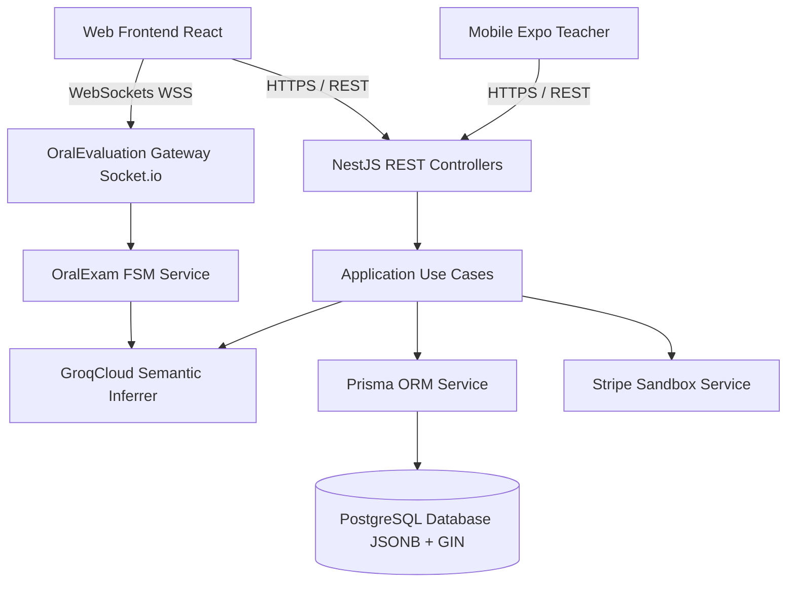

# Plan Técnico de Arquitectura e Implementación: Plataforma LMS Adaptativa con Tutoría Virtual 3D e IA

## 1. Metadatos del Plan
- **ID de la Spec Asociada:** `SPEC-01` ([spec.md](file:///c:/EDBERTO/ULTIMO/SW1/PROYECTO%20FINAL/SW1-PF-DOCENTE-VIRTUAL-SDD-2026-2/specs/01-plataforma-lms-adaptativa/spec.md))
- **Estado:** `En Revisión`
- **Versión:** `1.0.0`
- **Dependencias:** `Ninguna` (Plan Técnico Integral de la Arquitectura - 100% del Sistema)

---

## 2. Visión General de Arquitectura (Monorepo Turborepo + pnpm)

La arquitectura desacopla estrictamente las tres aplicaciones sin carpetas compartidas intermedias (`packages/` no existe). Cada aplicación (`backend`, `web`, `mobile`) es 100% autocontenida con sus propios tipos, esquemas de datos, contratos, configuraciones de TypeScript y linters:

```
sw1-pf-docente-virtual/
├── apps/
│   ├── backend/             # NestJS + Prisma + PostgreSQL + WebSockets (Tipos, DTOs y Schemas locales)
│   ├── web/                 # React + Vite + TailwindCSS + Three.js / R3F (Tipos y modelos web locales)
│   └── mobile/              # Expo React Native + SQLite Offline (Tipos y modelos móviles locales)
├── specs/
│   └── 01-plataforma-lms-adaptativa/
│       ├── spec.md
│       ├── plan.md
│       └── tasks.md
├── docs/
│   └── constitution.md
├── AGENTS.md
├── pnpm-workspace.yaml      # Workspace configurado estrictamente con ["apps/*"]
└── turbo.json
```

---

## 3. Arquitectura de `apps/backend` (NestJS Modular Monolith con Clean Architecture)

### 3.1 Estructura Modular de Dominio
Cada módulo sigue la separación estricta en tres capas:
- `domain/`: Entidades de negocio puras, Value Objects, interfaces de repositorios y eventos de dominio.
- `application/`: Casos de uso (Use Cases), DTOs y servicios de orquestación.
- `infrastructure/`: Implementaciones de persistencia con Prisma, controladores REST, gateways WebSockets y clientes externos (GroqCloud, Stripe).

```
apps/backend/src/modules/
├── iam/                     # Autenticación JWT (Access/Refresh), Guards RBAC/PBAC, Hashing argon2/bcrypt
├── courses/                 # Gestión jerárquica de Cursos, Módulos, Lecciones y verificación de propiedad
├── diagnostics/             # Generador de cuestionario dinámico IA y algoritmo de posicionamiento en lección
├── learning-paths/          # Registro y cálculo adaptativo de rutas de aprendizaje
├── oral-evaluations/        # Gateway WebSockets (Socket.io), FSM del examen oral y evaluación semántica GroqCloud
├── subscriptions/           # Motor de créditos iniciales (3 por defecto) e integración de Stripe (Modo Sandbox)
└── teacher-analytics/       # Consultas analíticas y motor IA de detección de fallas conceptuales recurrentes
```

### 3.2 Diagrama de Flujo de Datos y Componentes Backend



---

## 4. Diseño y Esquema de Base de Datos (Prisma ORM)

```prisma
datasource db {
  provider = "postgresql"
  url      = env("DATABASE_URL")
}

generator client {
  provider = "prisma-client-js"
}

enum UserRole {
  STUDENT
  TEACHER
  ADMIN
}

enum SubscriptionStatus {
  NONE
  TRIAL_CREDITS
  ACTIVE_SUBSCRIPTION
  EXPIRED
}

enum AvatarIdentity {
  PROF_ELENA
  PROF_DAVID
}

model User {
  id                  String             @id @default(uuid()) @db.Uuid
  email               String             @unique @db.VarChar(255)
  passwordHash        String             @map("password_hash") @db.VarChar(255)
  fullName            String             @map("full_name") @db.VarChar(150)
  role                UserRole           @default(STUDENT)
  creditsBalance      Int                @default(0) @map("credits_balance")
  subscriptionStatus  SubscriptionStatus @default(NONE) @map("subscription_status")
  preferredAvatar     AvatarIdentity?    @map("preferred_avatar")
  createdAt           DateTime           @default(now()) @map("created_at")
  updatedAt           DateTime           @updatedAt @map("updated_at")
  deletedAt           DateTime?          @map("deleted_at")

  // Relaciones
  coursesAuthored     Course[]           @relation("TeacherCourses")
  unlockedLessons     LessonUnlock[]
  diagnosticAttempts  DiagnosticAttempt[]
  oralExamAttempts    OralExamAttempt[]
  subscriptions       Subscription[]

  @@index([email])
  @@index([role])
  @@map("users")
}

model Course {
  id              String            @id @default(uuid()) @db.Uuid
  title           String            @db.VarChar(200)
  description     String            @db.Text
  teacherId       String            @map("teacher_id") @db.Uuid
  published       Boolean           @default(false)
  createdAt       DateTime          @default(now()) @map("created_at")
  updatedAt       DateTime          @updatedAt @map("updated_at")
  deletedAt       DateTime?         @map("deleted_at")

  teacher         User              @relation("TeacherCourses", fields: [teacherId], references: [id], onDelete: Cascade)
  modules         Module[]
  oralExamConfig  OralExamConfig?
  oralAttempts    OralExamAttempt[]

  @@index([teacherId])
  @@map("courses")
}

model Module {
  id          String     @id @default(uuid()) @db.Uuid
  courseId    String     @map("course_id") @db.Uuid
  title       String     @db.VarChar(200)
  orderIndex  Int        @map("order_index")
  createdAt   DateTime   @default(now()) @map("created_at")
  deletedAt   DateTime?  @map("deleted_at")

  course      Course     @relation(fields: [courseId], references: [id], onDelete: Cascade)
  lessons     Lesson[]

  @@index([courseId, orderIndex])
  @@map("modules")
}

model Lesson {
  id                  String         @id @default(uuid()) @db.Uuid
  moduleId            String         @map("module_id") @db.Uuid
  title               String         @db.VarChar(200)
  videoResourceId     String         @map("video_resource_id") @db.VarChar(100) // YouTube ID
  pedagogicalContext  String         @map("pedagogical_context") @db.Text       // Insumo de IA
  orderIndex          Int            @map("order_index")
  createdAt           DateTime       @default(now()) @map("created_at")
  deletedAt           DateTime?      @map("deleted_at")

  module              Module         @relation(fields: [moduleId], references: [id], onDelete: Cascade)
  unlocks             LessonUnlock[]

  @@index([moduleId, orderIndex])
  @@map("lessons")
}

model LessonUnlock {
  id          String    @id @default(uuid()) @db.Uuid
  studentId   String    @map("student_id") @db.Uuid
  lessonId    String    @map("lesson_id") @db.Uuid
  unlockedAt  DateTime  @default(now()) @map("unlocked_at")

  student     User      @relation(fields: [studentId], references: [id], onDelete: Cascade)
  lesson      Lesson    @relation(fields: [lessonId], references: [id], onDelete: Cascade)

  @@unique([studentId, lessonId])
  @@index([studentId])
  @@map("lesson_unlocks")
}

model DiagnosticAttempt {
  id                String    @id @default(uuid()) @db.Uuid
  studentId         String    @map("student_id") @db.Uuid
  assignedCourseId  String?   @map("assigned_course_id") @db.Uuid
  assignedLessonId  String?   @map("assigned_lesson_id") @db.Uuid
  questionsJson     Json      @map("questions_json") // Preguntas generadas por IA
  answersJson       Json      @map("answers_json")   // Respuestas del estudiante
  creditsGranted    Int       @default(3) @map("credits_granted")
  completedAt       DateTime  @default(now()) @map("completed_at")

  student           User      @relation(fields: [studentId], references: [id], onDelete: Cascade)

  @@index([studentId])
  @@map("diagnostic_attempts")
}

model OralExamConfig {
  id              String    @id @default(uuid()) @db.Uuid
  courseId        String    @unique @map("course_id") @db.Uuid
  minPassingScore Int       @default(70) @map("min_passing_score")
  rubricsJson     Json      @map("rubrics_json") // Array de 5-10 preguntas con respuestas modelo
  updatedAt       DateTime  @updatedAt @map("updated_at")

  course          Course    @relation(fields: [courseId], references: [id], onDelete: Cascade)

  @@map("oral_exam_configs")
}

model OralExamAttempt {
  id                    String         @id @default(uuid()) @db.Uuid
  studentId             String         @map("student_id") @db.Uuid
  courseId              String         @map("course_id") @db.Uuid
  conductorAvatar       AvatarIdentity @map("conductor_avatar")
  finalScore            Int            @map("final_score") // 0 a 100
  passed                Boolean
  conversationSnapshot  Json           @map("conversation_snapshot") // Inmutable
  completedAt           DateTime       @default(now()) @map("completed_at")

  student               User           @relation(fields: [studentId], references: [id], onDelete: Cascade)
  course                Course         @relation(fields: [courseId], references: [id], onDelete: Cascade)

  @@index([studentId])
  @@index([courseId])
  @@map("oral_exam_attempts")
}

model Subscription {
  id                    String             @id @default(uuid()) @db.Uuid
  studentId             String             @map("student_id") @db.Uuid
  stripeCustomerId      String?            @map("stripe_customer_id") @db.VarChar(100)
  stripeSubscriptionId  String?            @map("stripe_subscription_id") @db.VarChar(100)
  status                SubscriptionStatus @default(NONE)
  currentPeriodEnd      DateTime?          @map("current_period_end")
  createdAt             DateTime           @default(now()) @map("created_at")

  student               User               @relation(fields: [studentId], references: [id], onDelete: Cascade)

  @@index([studentId])
  @@map("subscriptions")
}

model SystemSetting {
  id          String   @id @default(uuid()) @db.Uuid
  key         String   @unique @db.VarChar(100)
  value       String   @db.VarChar(255)
  description String?  @db.Text
  updatedAt   DateTime @updatedAt @map("updated_at")

  @@map("system_settings")
}
```

---

## 5. Contratos de API REST (Endpoints Backend)

### 5.1 Módulo `iam`
- `POST /api/v1/auth/register`: Registro de usuario (`email`, `password`, `fullName`, `role`). Emite JWT Access (15m) + Refresh (7d).
- `POST /api/v1/auth/login`: Autenticación con credenciales. Retorna usuario y tokens.
- `POST /api/v1/auth/refresh`: Renovación de Access Token mediante Refresh Token válido.
- `GET /api/v1/auth/me`: Perfil del usuario autenticado con balance de créditos y estado de suscripción.

### 5.2 Módulo `courses`
- `POST /api/v1/courses`: Creación de curso por usuario `TEACHER` o `ADMIN`.
- `GET /api/v1/courses`: Catálogo público de cursos publicados con conteo de lecciones.
- `GET /api/v1/courses/:id`: Jerarquía completa (Curso ➔ Módulos ➔ Lecciones) con estado de desbloqueo según el usuario autenticado.
- `PUT /api/v1/courses/:id`: Edición protegida por `CourseOwnerGuard` (solo el docente creador o ADMIN).
- `DELETE /api/v1/courses/:id`: Borrado lógico (*soft delete*) del curso y sus módulos/lecciones.
- `POST /api/v1/courses/:id/modules`: Creación de módulo temático.
- `POST /api/v1/modules/:id/lessons`: Creación de lección con `videoResourceId` (YouTube) y `pedagogicalContext`.

### 5.3 Módulo `diagnostics`
- `GET /api/v1/diagnostics/questions`: Genera dinámicamente el cuestionario de 5 a 15 preguntas vía GroqCloud basándose en los metadatos de lecciones de la base de datos.
- `POST /api/v1/diagnostics/submit`: Recibe respuestas del estudiante, calcula nivel de dominio, determina el curso y lección específica asignada, y acredita los 3 créditos de bienvenida.

### 5.4 Módulo `subscriptions`
- `POST /api/v1/lessons/:id/access`: Intenta acceder a una lección:
  - Si ya está desbloqueada o el usuario tiene `ACTIVE_SUBSCRIPTION`, retorna `{ canAccess: true, videoResourceId: "..." }`.
  - Si tiene `creditsBalance > 0`, descuenta 1 crédito atómicamente, registra `LessonUnlock` y permite el acceso.
  - Si tiene 0 créditos y no tiene suscripción activa, responde `402 Payment Required` con `{ canAccess: false, reason: "CREDITS_EXHAUSTED" }`.
- `POST /api/v1/subscriptions/checkout-session`: Genera sesión de pago de prueba en Stripe para suscripción mensual.
- `POST /api/v1/subscriptions/webhook`: Manejador de eventos de Stripe (simulación de pago exitoso de tarjeta `4242 4242 4242 4242`) que activa el estado `ACTIVE_SUBSCRIPTION`.
- `PATCH /api/v1/admin/settings/initial-credits`: Endpoint exclusivo de `ADMIN` para modificar el balance de créditos iniciales.

### 5.5 Módulo `teacher-analytics`
- `GET /api/v1/analytics/teacher/dashboard`: Métricas generales del profesor (total inscritos, tasas de completitud, promedios de exámenes orales).
- `GET /api/v1/analytics/courses/:courseId/students`: Listado detallado de estudiantes con sus intentos y transcripciones completas.
- `GET /api/v1/analytics/courses/:courseId/failure-hotspots`: Módulo de Feedback Docente. Algoritmo de IA que clasifica los temas y conceptos donde los estudiantes reprueban (< 70%) y genera la recomendación pedagógica cualitativa.

---

## 6. Arquitectura del Examen Oral 3D y WebSockets Gateway

### 6.1 Orquestación en Tiempo Real (Socket.io Namespace `/oral-evaluations`)
- **Autenticación:** El handshake de WebSocket valida el JWT del estudiante.
- **FSM en Memoria:** Cada sesión de examen oral se modela como una máquina de estados finita:

```
[INIT] 
  │  (Event: start_exam con courseId y selectedAvatar)
  ▼
[QUESTION_DELIVERY] ────► Emite pregunta con texto y orden
  │  (Cliente reproduce TTS con voz según Avatar y anima lip-sync en jawOpen)
  ▼
[STUDENT_RECORDING] ────► Cliente escucha con SpeechRecognition nativo
  │  (Cliente envía submit_answer con transcripción de voz)
  ▼
[SEMANTIC_ANALYSIS] ────► Backend invoca GroqCloud con prompt estructurado JSON
  │  (Evalúa concordancia frente a la rúbrica pedagógica, genera score 0-100 y feedback)
  ▼
[FEEDBACK_DELIVERY] ────► Emite feedback al cliente
  │  (Avatar adopta expresión reactiva: sonrisa si >= 70, aliento si < 70)
  ├──► [¿Quedan preguntas?] ──► [QUESTION_DELIVERY]
  └──► [¿Última pregunta?] ──► [COMPLETED] ──► Persiste OralExamAttempt inmutable
```

### 6.2 Prompt Engineering y Validación Semántica con GroqCloud
- **Modelo:** `llama-3.3-70b-versatile` en GroqCloud con `response_format: { type: "json_object" }`.
- **Esquema Zod de Salida Estricta en Backend:**

```typescript
export const SemanticEvaluationSchema = z.object({
  score: z.number().min(0).max(100),
  passed: z.boolean(),
  conceptualAccuracy: z.number().min(0).max(100),
  feedbackText: z.string().min(10),
  detectedMisconceptions: z.array(z.string()),
});
```

---

## 7. Arquitectura de `apps/web` (React + Three.js / R3F)

### 7.1 Jerarquía y Componentes del Docente Virtual 3D
- `OralExamContainer.tsx`: Contenedor principal Split-Screen 60/40.
  - `AvatarPanel.tsx` (60% ancho):
    - `Canvas3D`: Canvas de `@react-three/fiber` sobre fondo plano sin geometría superflua.
    - `TeacherAvatarModel.tsx`: Carga el modelo `.glb` (Elena o David vía Ready Player Me) con `useGLTF`.
    - `useLipSync`: Hook que conecta la Web Audio API con el morph target `jawOpen` durante la síntesis TTS.
    - `useAvatarGestures`: Hook que gestiona las animaciones esqueléticas y blendshapes en los 4 estados:
      1. *Idle:* Animación sinusoidal en columna/pecho + parpadeo con `eyeBlinkLeft`/`eyeBlinkRight` cada 4s.
      2. *Talking:* Gestos suaves de brazos/manos al hablar.
      3. *Listening:* Inclinación del torso + asentimiento con hueso del cuello (`head`/`neck`).
      4. *Feedback:* `mouthSmile` (aprobado) o mirada empática de aliento (refuerzo).
  - `OralExamHud.tsx` (40% ancho):
    - `ExamProgressBar`: Barra de progreso (ej. Pregunta 3 de 7).
    - `QuestionCard`: Pregunta actual redactada.
    - `AudioWaveform`: Onda sonora canvas/SVG reactiva a la amplitud del micrófono.
    - `LiveTranscript`: Transcripción en vivo del `SpeechRecognition`.
    - `SubmitControls`: Botón "Terminar Respuesta / Enviar" y enlace fallback de texto.
    - `ImmediateFeedbackCard`: Tarjeta de retroalimentación inmediata con nota 0-100.

---

## 8. Arquitectura de `apps/mobile` (Expo React Native para Profesores)

### 8.1 Restricción de Roles y Offline-First
- **Guardia de Acceso:** Durante el inicio de sesión, el servicio valida `role === 'TEACHER' || role === 'ADMIN'`. Si el usuario es `STUDENT`, se deniega el acceso y se muestra el mensaje explicativo formal.
- **Cero Renderizado 3D:** El bundle de la app móvil prescinde totalmente de librerías WebGL/Three.js.
- **Capa Offline-First con TanStack React Query + `expo-sqlite`:**
  - Persistencia de queries en base de datos SQLite local usando `createAsyncStoragePersister` o adaptador nativo SQLite.
  - Al abrir la app sin conexión, React Query entrega el snapshot local inmediatamente (< 300 ms).
  - Al detectar conectividad de red (`NetInfo`), ejecuta background revalidation automática.
- **Pantallas Principales:**
  - `TeacherDashboardScreen`: KPIs de cursos, promedios y total de estudiantes.
  - `CourseStudentsScreen`: Lista de alumnos, notas de exámenes orales y transcripciones completas.
  - `FailureHotspotsScreen` (Feedback Pedagógico): Lista de conceptos con mayor tasa de falla (< 70%) y recomendación pedagógica cualitativa generada por IA.

---

## 9. Estrategia de Testing y Verificación Automatizada

| Tipo de Test | Alcance | Herramienta | Criterio de Éxito |
| :--- | :--- | :--- | :--- |
| **Unit Tests** | Servicios de dominio, lógica de créditos, cálculo de notas, Zod schemas | Vitest / Jest | 100% funciones de negocio cubiertas |
| **Integration Tests** | Repositorios Prisma, autenticación JWT, guards RBAC/PBAC, transacciones | Supertest + Testcontainers (PostgreSQL) | Todos los endpoints y contratos HTTP en verde |
| **WebSocket FSM Tests** | Transiciones de estado del examen oral (`QUESTION_DELIVERY` ➔ `STUDENT_RECORDING` ➔ `FEEDBACK`) | Socket.io Client Test Suite | Máquina de estados libre de deadlocks |
| **Linter & Formato** | Análisis estático de código en todo el monorepo | ESLint + Prettier (`pnpm lint`) | **0 warnings y 0 errors** |

---

## 10. Desglose en Vertical Slices para Implementación (`tasks.md`)

- **Slice 1: Monorepo Foundation & Tooling:** Configuración de Turborepo, pnpm workspaces (`apps/*`), TypeScript base, ESLint y Prettier configurados de forma local e independiente en cada aplicación (`backend`, `web`, `mobile`).
- **Slice 2: Backend Core & IAM Module:** NestJS bootstrap, PostgreSQL + Prisma setup, autenticación JWT (Access/Refresh), roles (`STUDENT`, `TEACHER`, `ADMIN`), PBAC `CourseOwnerGuard` y soft delete.
- **Slice 3: LMS Core & Video Player:** CRUD de Cursos, Módulos y Lecciones con YouTube API en Backend y Frontend Web, incluyendo la opción de **salto demostrativo al examen oral**.
- **Slice 4: Preevaluación Diagnóstica Dinámica:** Motor GroqCloud de 5-15 preguntas desde la BD, cuestionario web sin avatar 3D, posicionamiento adaptativo por lección y acreditación inicial de 3 créditos.
- **Slice 5: Sistema de Créditos por Lección y Suscripción Stripe (Sandbox):** Descuento de créditos al abrir lecciones nuevas, reapertura gratuita, muro de pago y suscripción con tarjeta test `4242 4242 4242 4242`.
- **Slice 6: Docente Virtual 3D y Examen Oral en Tiempo Real:** Three.js / R3F en Web con Layout Split-Screen 60/40, selector Elena/David, gesticulación en 4 estados, Web Speech API (lip-sync y STT), FSM WebSockets y persistencia de snapshots inmutables.
- **Slice 7: App Móvil Docente Offline-First y Módulo de Feedback:** Aplicación Expo para profesores con TanStack Query + SQLite, dashboard analítico y detección automática de temas con mayores fallas recurrentes.
