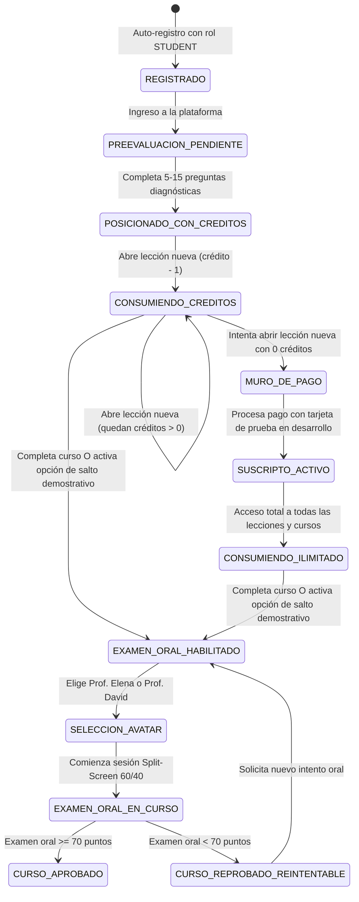
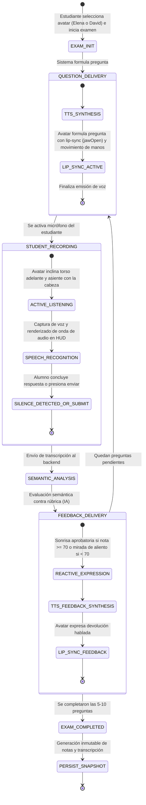

# Especificación Funcional: Plataforma LMS Adaptativa con Tutoría Virtual 3D e IA (Spec 01)

## 1. Metadatos de la Spec
- **ID:** `SPEC-01`
- **Estado:** `En Revisión`
- **Versión:** `1.1.0`
- **Dependencias:** `Ninguna` (Especificación Integral del Sistema - 100% del Alcance)

---

## 2. Contexto y Objetivo de Negocio
- **Problema:** Los sistemas LMS convencionales presentan rutas formativas estáticas y unidireccionales que obligan a los estudiantes a cursar contenidos que ya dominan o que no se adecúan a su nivel real. Además, las evaluaciones tradicionales basadas en selección múltiple facilitan la adivinanza y no evalúan el dominio conceptual ni la expresión oral del alumno. Por su parte, los docentes carecen de herramientas analíticas ágiles para identificar en tiempo real los conceptos y temas donde los alumnos fallan de manera recurrente.
- **Valor Aportado:**
  1. **Hiper-personalización:** Diagnóstico inicial dinámico que posiciona al estudiante en la lección y curso exacto donde debe comenzar.
  2. **Evaluación de Dominio Real con Docente 3D:** Evaluación oral interactiva conducida por un Docente Virtual 3D al finalizar cada curso, evaluando semánticamente las respuestas verbales del estudiante frente a rúbricas pedagógicas.
  3. **Composición Visual y Empatía Gestual:** Interfaz de examen oral en formato Split-Screen (60% Avatar 3D en plano medio sobre fondo plano limpio y 40% HUD interactivo), con selector previo de docente (Prof. Elena o Prof. David) y un sistema orgánico de gesticulaciones físicas y vocales en 4 estados.
  4. **Monetización Sostenible:** Modelo de 3 créditos iniciales para desbloqueo de lecciones y posterior muro de pago con suscripción mensual en entorno de pruebas.
  5. **Feedback Pedagógico Docente:** Aplicación móvil analítica para profesores que identifica automáticamente las brechas conceptuales críticas del alumnado con soporte de consulta sin conexión.
  6. **Flexibilidad Demostrativa Académica:** Mecanismo opcional para saltar lecciones e ir directamente a la evaluación oral del curso para fines de demostración académica.

---

## 3. Lenguaje Ubicuo (Glosario de Dominio Estricto)

| Término de Negocio | Definición Precisa | Término Prohibido / Alias Erróneo |
| :--- | :--- | :--- |
| `Usuario` | Entidad registrada en el sistema con credenciales únicas y un rol asignado (`STUDENT`, `TEACHER`, `ADMIN`). | Cuenta, Perfil suelto, Cliente |
| `Docente Creador` | Usuario con rol `TEACHER` propietario de un curso, con derechos exclusivos de edición de contenidos y rúbricas. | Dueño, Editor, Manager |
| `Curso` | Unidad formativa de nivel superior compuesta jerárquicamente por módulos y lecciones. | Asignatura, Taller, Materia |
| `Módulo` | Agrupación temática intermedia dentro de un curso que contiene un conjunto ordenado de lecciones. | Sección, Capítulo, Unidad |
| `Lección` | Unidad mínima de contenido pedagógico audiovisual con metadatos descriptivos y contexto conceptual. | Clase, Tema, Video |
| `Preevaluación Diagnóstica` | Cuestionario inicial de 5 a 15 preguntas generadas dinámicamente por IA en base a los cursos y lecciones existentes, presentado en formato web **sin avatar 3D**, para ubicar el punto de partida del estudiante. | Test de entrada, Quiz rápido, Encuesta |
| `Posicionamiento Adaptativo` | Acción del sistema que asigna al estudiante un curso y una lección específica recomendada en función de su diagnóstico. | Asignación manual, Salto ciego |
| `Crédito de Acceso` | Unidad de consumo otorgada al estudiante (3 créditos iniciales por defecto, editable por el ADMIN) que se descuenta al abrir una lección no desbloqueada previamente. | Moneda, Token de pago, Puntos |
| `Lección Desbloqueada` | Lección cuyo acceso fue adquirido mediante un crédito o bajo una suscripción activa; su reapertura posterior es ilimitada y no vuelve a descontar créditos. | Lección abierta, Lección vista |
| `Suscripción Mensual` | Estado de acceso continuo e irrestricto a todas las lecciones y cursos tras agotar los créditos iniciales, procesado mediante pasarela de pago en modo desarrollo. | Membresía, Pago único |
| `Docente Virtual 3D` | Entidad virtual interactiva con representación tridimensional que conduce la evaluación oral final de un curso al término del mismo con gesticulación física y sincronización labial sincrónica. | Bot 3D, Asistente de preevaluación, Avatar de lección |
| `Selector de Docente` | Mecanismo previo al inicio del examen oral donde el estudiante elige entre dos identidades docentes: **Prof. Elena** (femenino, voz TTS femenina) o **Prof. David** (masculino, voz TTS masculina). | Switcher de skin, Cambio de personaje |
| `Layout Split-Screen 60/40` | Disposición de pantalla del examen oral compuesta por un panel izquierdo (60%) que aloja al avatar 3D en plano medio sobre fondo plano limpio, y un panel derecho (40%) que aloja el HUD interactivo. | Pantalla partida, Interfaz dual |
| `Gesticulación en 4 Estados` | Ciclo comportamental del avatar 3D que transita entre: 1. Reposo/Idle (respiración y parpadeo involuntario), 2. Habla/Pregunta (lip-sync y gestos de manos), 3. Escucha Activa (inclinación y asentimiento), y 4. Feedback Reactivo (sonrisa aprobatoria >= 70 o mirada de aliento < 70). | Animación fija, Bucle de movimientos |
| `HUD del Examen Oral` | Panel interactivo lateral que reúne: contador y barra de progreso, tarjeta con la pregunta redactada, visualizador de onda sonora del micrófono, transcripción en tiempo real, botón de envío y tarjeta de feedback semántico. | Panel de control, Menú lateral |
| `Examen Oral Final` | Evaluación verbal interactiva conducida por el Docente Virtual 3D compuesta por 5 a 10 preguntas habladas, con captura de respuesta por voz y calificación semántica. | Test oral, Entrevista, Quiz 3D |
| `Rúbrica Pedagógica` | Criterio conceptual y respuesta modelo asociada a cada pregunta del examen oral para contrastar la respuesta del alumno con un umbral de aprobación del 70%. | Clave de examen, Pauta |
| `Snapshot de Intento` | Registro inmutable e histórico que congela la fecha, preguntas, transcripciones de voz, nota (escala 0-100) y retroalimentación cualitativa de una evaluación oral. | Historial editable, Log |
| `Feedback Docente` | Panel analítico y reporte pedagógico para profesores que identifica automáticamente los conceptos con mayor tasa de falla recurrente en los exámenes orales. | Estadísticas simples, Tablero |

---

## 4. Modelo Conceptual y Contratos de Datos (I/O Schemas)

### 4.1 Entidades Principales y Atributos

```text
Usuario:
  - id: UUID
  - email: String (único, formato email válido)
  - password_hash: String
  - full_name: String
  - role: Enum [STUDENT, TEACHER, ADMIN]
  - credits_balance: Integer (mínimo 0, inicializado en 3 tras preevaluación)
  - subscription_status: Enum [NONE, TRIAL_CREDITS, ACTIVE_SUBSCRIPTION, EXPIRED]
  - preferred_avatar_id: Enum [PROF_ELENA, PROF_DAVID]? (preferencia persistida del alumno)
  - created_at: Timestamp
  - deleted_at: Timestamp? (soft delete)

Curso:
  - id: UUID
  - title: String (3 a 150 caracteres)
  - description: String
  - teacher_id: UUID (referencia a Usuario con rol TEACHER)
  - published: Boolean (default false)
  - created_at: Timestamp
  - deleted_at: Timestamp?

Módulo:
  - id: UUID
  - course_id: UUID
  - title: String
  - order_index: Integer
  - deleted_at: Timestamp?

Lección:
  - id: UUID
  - module_id: UUID
  - title: String
  - video_resource_id: String (identificador de recurso audiovisual)
  - pedagogical_context: String (descripción conceptual para el motor de IA)
  - order_index: Integer
  - deleted_at: Timestamp?

DesbloqueoLección:
  - id: UUID
  - student_id: UUID
  - lesson_id: UUID
  - unlocked_at: Timestamp

PreevaluacionDiagnostica:
  - id: UUID
  - student_id: UUID
  - questions: Array<PreguntaDiagnostica>
  - answers: Array<RespuestaDiagnostica>
  - assigned_course_id: UUID
  - assigned_lesson_id: UUID
  - completed_at: Timestamp

ExamenOralCurso:
  - id: UUID
  - course_id: UUID
  - questions: Array<PreguntaOralConfigurada> (5 a 10 preguntas con rúbrica pedagógica)
  - min_passing_score: Integer (default 70, escala 0-100)

IntentoExamenOral (Snapshot Inmutable):
  - id: UUID
  - student_id: UUID
  - course_id: UUID
  - conductor_avatar_id: Enum [PROF_ELENA, PROF_DAVID]
  - score: Integer (0 a 100)
  - passed: Boolean (score >= 70)
  - conversation_snapshot: Array<{
      question_index: Integer,
      question_text: String,
      student_spoken_transcript: String,
      ai_semantic_score: Integer,
      feedback_text: String
    }>
  - completed_at: Timestamp

SuscripciónPago:
  - id: UUID
  - student_id: UUID
  - payment_provider_reference: String
  - status: Enum [ACTIVE, CANCELLED, FAILED]
  - current_period_end: Timestamp
```

### 4.2 Contratos Conceptuales de Entrada / Salida (I/O)

#### Contrato 1: Registro e Inicio de Sesión
- **Entrada Registro:**
  - `email`: String (válido, único)
  - `password`: String (mínimo 8 caracteres, al menos 1 número y 1 mayúscula)
  - `full_name`: String (2 a 100 caracteres)
  - `role`: Enum [`STUDENT`, `TEACHER`]
- **Salida Registro / Login:**
  - `access_token`: String (JWT firmado, vigencia corta)
  - `refresh_token`: String (JWT firmado, vigencia extendida)
  - `user`: Datos públicos del usuario (`id`, `email`, `full_name`, `role`, `credits_balance`, `subscription_status`).

#### Contrato 2: Finalización de Preevaluación y Posicionamiento
- **Entrada:**
  - `student_id`: UUID
  - `answers`: Array de `{ question_id: String, selected_option_or_text: String }`
- **Salida:**
  - `assigned_course`: `{ id: UUID, title: String }`
  - `assigned_lesson`: `{ id: UUID, title: String, order_index: Integer }`
  - `initial_credits_granted`: Integer (3 por defecto)
  - `recommended_action`: String

#### Contrato 3: Apertura / Acceso a Lección (Control de Créditos)
- **Entrada:**
  - `lesson_id`: UUID
- **Salida Exitosa (Acceso Permitido):**
  - `can_access`: `true`
  - `consumed_credit`: Boolean (`true` si era lección nueva, `false` si ya estaba desbloqueada o bajo suscripción)
  - `remaining_credits`: Integer
  - `video_resource_id`: String
  - `lesson_details`: Metadatos de la lección
- **Salida de Bloqueo (Paywall / Créditos Agotados):**
  - `can_access`: `false`
  - `reason`: `CREDITS_EXHAUSTED`
  - `paywall_required`: `true`

#### Contrato 4: Suscripción Mensual (Pasarela en Modo Desarrollo)
- **Entrada:**
  - `payment_method_test_token`: String (ej. tarjeta de prueba `4242 4242 4242 4242`)
- **Salida:**
  - `subscription_status`: `ACTIVE_SUBSCRIPTION`
  - `valid_until`: Timestamp
  - `confirmation_code`: String

#### Contrato 5: Sesión de Examen Oral con Docente 3D (Tiempo Real)
- **Mensaje Cliente (Inicio de Examen):** `{ event: "START_ORAL_EXAM", course_id: UUID, selected_avatar: "PROF_ELENA" | "PROF_DAVID" }`
- **Mensaje Servidor (Entrega de Pregunta):** `{ event: "QUESTION_DELIVERY", question_index: Integer, question_text: String, audio_speech_payload: String, target_gesture_state: "TALKING_QUESTION" }`
- **Mensaje Cliente (Respuesta Estudiante):** `{ event: "STUDENT_RESPONSE_SUBMITTED", student_transcript: String }`
- **Mensaje Servidor (Evaluación y Feedback):** `{ event: "FEEDBACK_DELIVERY", semantic_score: Integer, feedback_text: String, audio_speech_payload: String, target_gesture_state: "FEEDBACK_APPROVED" | "FEEDBACK_REINFORCE" }`
- **Mensaje Servidor (Finalización de Examen):** `{ event: "EXAM_COMPLETED", final_score: Integer, passed: Boolean, snapshot_id: UUID }`

#### Contrato 6: Feedback Docente y Analítica de Fallas Recurrentes (Móvil)
- **Entrada:** `teacher_id`: UUID, `course_id`: UUID?
- **Salida:**
  - `total_students_enrolled`: Integer
  - `average_course_completion_rate`: Float (0.0 a 100.0)
  - `average_oral_exam_score`: Float (0.0 a 100.0)
  - `critical_failure_hotspots`: Array<{
      concept_title: String,
      failure_rate_percentage: Float,
      total_failed_attempts: Integer,
      sample_misconceptions: Array<String>,
      pedagogical_recommendation: String
    }>

---

## 5. Matriz de Estados, Transiciones y Especificación Visual 3D

### 5.1 Ciclo de Vida del Estudiante y Acceso a Contenidos



### 5.2 Máquina de Estados Finita (FSM) del Examen Oral con el Docente Virtual 3D



### 5.3 Especificación Visual, Gestual y Composición del Docente Virtual 3D

```
+-----------------------------------------------------------------------------------+
|                            PANTALLA DE EXAMEN ORAL FINAL                           |
+---------------------------------------------+-------------------------------------+
|         PANEL IZQUIERDO: AVATAR 3D (60%)    |      PANEL DERECHO: HUD (40%)       |
|                                             |                                     |
|  [Fondo Plano Limpio - Zero 3D Clutter]     |  [Barra de Progreso: Pregunta 3/7]  |
|                                             |  ---------------------------------  |
|                                             |  [Tarjeta de Pregunta Actual]       |
|                 (   )                       |  "Explique cómo el principio de     |
|                ( * * )  <- Gesticulación    |   encapsulamiento protege los       |
|                  \=/       Vocal & Facial   |   datos en un objeto."              |
|                 __|__                       |  ---------------------------------  |
|               /   |   \ <- Gesticulación    |  [Visualizador de Onda Sonora ~~~]  |
|              |    |    |   Física (Manos    |  [Transcripción en Tiempo Real]     |
|                   |        y Torso)         |  "El encapsulamiento oculta..."     |
|                                             |  ---------------------------------  |
|        [Encuadre: Busto / Plano Medio]      |  [Botón: Terminar Respuesta / Enviar] |
|                                             |  [Enlace: Fallback de Texto]        |
|                                             |  ---------------------------------  |
|  Docente Activo: Prof. Elena / David        |  [Tarjeta de Feedback y Nota 0-100] |
+---------------------------------------------+-------------------------------------+
```

1. **Composición de Pantalla (Layout Split-Screen 60/40):**
   - **Panel Izquierdo (60% ancho):** Canvas tridimensional dedicado al renderizado del avatar docente. Encuadre de cámara en **plano medio (busto/torso)**, centrado verticalmente, garantizando que tanto los movimientos faciales como los gestos de las manos y hombros sean plenamente visibles.
   - **Fondo del Canvas 3D:** **Fondo plano limpio y uniforme** (sin elementos arquitectónicos ni mobiliario 3D superfluo), asegurando máxima fluidez de renderizado, consumo mínimo de GPU y eliminación de cualquier distracción visual.
   - **Panel Derecho (40% ancho):** Interfaz HUD estructurada con fondo en contraste alto que contiene los componentes analíticos y de control del examen oral.

2. **Identidad y Vestimenta del Docente:**
   - **Estilo Visual:** Docente Profesional Moderno (EdTech Contemporáneo), con vestimenta formal-casual (blazer estructurado de corte actual sobre prenda neutra interior, peinado pulcro y estilizado, y expresión facial cálida y empática).
   - **Selector de Docente:** En la pantalla introductoria del examen, el estudiante selecciona voluntariamente quién conducirá su examen entre:
     - **Prof. Elena:** Identidad docente femenina, voz sintetizada en tono femenino natural.
     - **Prof. David:** Identidad docente masculina, voz sintetizada en tono masculino natural.

3. **Sistema de Gesticulación Orgánica en 4 Estados:**
   - **Estado 1: Reposo / Idle:** Movimiento sinusoidal sutil del torso simulando respiración natural y parpadeo involuntario periódico de los ojos cada 3 a 5 segundos para erradicar cualquier sensación de estatua rígida.
   - **Estado 2: Habla / Formulación de Pregunta:** Sincronización labial dinámica (*lip-sync*) en el morph target `jawOpen` sincronizada con la locución de voz sintetizada, complementada por gesticulación suave de manos y sutiles movimientos de cabeza para enfatizar conceptos clave.
   - **Estado 3: Escucha Activa:** Durante el turno de habla del estudiante, el avatar cesa el movimiento de manos, inclina sutilmente el torso hacia adelante y ejecuta pequeños movimientos de asentimiento con la cabeza (*nodding*) periódicos para denotar atención receptiva.
   - **Estado 4: Feedback Reactivo:**
     - *Aprobado (nota >= 70):* Expresión facial sonriente (`mouthSmile`), inclinación afirmativa de cabeza y postura corporal abierta de felicitación.
     - *Reprobado / Necesita Refuerzo (nota < 70):* Expresión facial empática y comprensiva, postura de aliento constructivo y tono orientativo hacia la superación de brechas.

4. **Componentes del HUD (Panel Derecho):**
   - **Indicador de Progreso:** Contador numérico (ej. "Pregunta 3 de 7") y barra de progreso porcentual.
   - **Tarjeta de la Pregunta:** Texto completo de la pregunta formulada por el avatar para respaldo visual del estudiante.
   - **Visualizador de Onda Sonora:** Componente interactivo que reacciona en tiempo real a las modulaciones de amplitud del micrófono del alumno mientras habla.
   - **Transcripción en Vivo:** Muestra progresiva del texto reconocido de la locución del alumno palabra por palabra.
   - **Controles de Envío:** Botón principal destacado "Terminar Respuesta / Enviar" y enlace accesible "Responder por texto" en caso de impedimento de micrófono.
   - **Tarjeta de Retroalimentación Inmediata:** Despliega la calificación semántica obtenida (0 a 100) y la justificación pedagógica una vez procesada la respuesta por la IA.

---

## 6. Historias de Usuario

- **HU-01 (Estudiante - Registro y Roles):** Como estudiante, quiero registrarme en la plataforma seleccionando mi rol para acceder a mi espacio formativo personalizado.
- **HU-02 (Estudiante - Diagnóstico sin Avatar):** Como estudiante nuevo, quiero rendir una preevaluación diagnóstica dinámica estructurada (sin avatar 3D) para que el sistema evalúe mis conocimientos iniciales y determine exactamente desde qué curso y lección debo comenzar.
- **HU-03 (Estudiante - Créditos y Desbloqueo de Lecciones):** Como estudiante, quiero disponer de 3 créditos iniciales para abrir y estudiar lecciones libremente, sabiendo que una vez desbloqueada una lección podré repasarla cuantas veces quiera sin costo adicional.
- **HU-04 (Estudiante - Muro de Pago y Suscripción Test):** Como estudiante que ha agotado sus 3 créditos, quiero poder activar una suscripción mensual utilizando una tarjeta de pruebas de desarrollo para continuar desbloqueando lecciones sin restricciones.
- **HU-05 (Estudiante - Examen Oral Interactivo 3D):** Como estudiante que finalizó un curso, quiero rendir un examen oral interactivo ante un Docente Virtual 3D en formato Split-Screen 60/40, respondiendo verbalmente por micrófono y recibiendo gesticulaciones empáticas y retroalimentación inmediata sobre mi desempeño.
- **HU-06 (Estudiante - Selección de Avatar Docente):** Como estudiante, quiero poder elegir antes de iniciar el examen oral si prefiero ser evaluado por la Prof. Elena o por el Prof. David para sentir mayor afinidad y comodidad en la sesión.
- **HU-07 (Estudiante - Salto Demostrativo de Lecciones):** Como evaluador o estudiante en sesión demostrativa, quiero tener la opción de saltar directamente al examen oral del curso para validar la interacción con el Docente 3D sin estar forzado a ver la totalidad de los videos.
- **HU-08 (Docente - Creación Jerárquica de Cursos):** Como profesor, quiero crear cursos estructurados en módulos y lecciones asociadas a recursos de video y contexto pedagógico en la plataforma web para impartir mi materia.
- **HU-09 (Docente - Configuración Híbrida de Exámenes Orales):** Como profesor, quiero que la IA genere automáticamente preguntas y rúbricas conceptuales para el examen oral de mi curso a partir de mis lecciones, permitiéndome editar, borrar o agregar criterios antes de publicarlo.
- **HU-10 (Docente - Dashboard Móvil y Feedback de Fallas Recurrentes):** Como profesor, quiero consultar desde mi aplicación móvil el desempeño de mis alumnos y visualizar un informe analítico inteligente que me señale los conceptos y preguntas donde los alumnos presentan mayores fallas para orientar mi retroalimentación pedagógica.
- **HU-11 (Docente - Acceso Móvil Offline-First):** Como profesor, quiero consultar las estadísticas de mis alumnos y el reporte de fallas en mi app móvil aun cuando no disponga de conexión a internet.
- **HU-12 (Administrador - Configuración de Créditos Iniciales):** Como administrador, quiero configurar el número de créditos gratuitos asignados a los nuevos estudiantes tras la preevaluación para ajustar la política comercial o académica de la plataforma.

---

## 7. Requisitos Funcionales (Notación EARS en Español)

### Módulo 1: Identidad, Accesos y Permisos (IAM)
- **RF-01 (Ubícuo):** El sistema deberá autenticar a los usuarios mediante tokens de acceso criptográficos con tiempo de expiración y tokens de refresco para renovación de sesión.
- **RF-02 (Basado en Eventos):** Cuando un usuario complete el formulario de registro con datos válidos y selección de rol (`STUDENT` o `TEACHER`), el sistema deberá persistir el usuario y emitir las credenciales de sesión correspondientes.
- **RF-03 (Basado en Estado):** Mientras un usuario posea el rol `STUDENT`, el sistema deberá restringir su acceso exclusivamente a la plataforma web, denegando el inicio de sesión en la aplicación móvil docente con un mensaje explicativo formal.
- **RF-04 (Basado en Estado):** Mientras un usuario posea el rol `TEACHER`, el sistema deberá permitir la edición y modificación de un curso únicamente si dicho docente es el creador y propietario registrado del curso.
- **RF-05 (Excepcional):** Si se solicita la eliminación de cualquier entidad académica (curso, módulo, lección o usuario), entonces el sistema deberá aplicar borrado lógico (*soft delete*) preservando la integridad de los históricos y auditorías.

### Módulo 2: Gestión de Contenido Académico (LMS Core)
- **RF-06 (Basado en Eventos):** Cuando un docente cree un curso en la web, el sistema deberá permitir la definición estructurada de Módulos ordenados y Lecciones secuenciales con su identificador audiovisual y metadatos pedagógicos.
- **RF-07 (Ubícuo):** El sistema deberá reproducir el contenido audiovisual de las lecciones integrando la interfaz de reproducción y registrando el evento de visualización completa.
- **RF-08 (Opcional):** Donde el estudiante decida utilizar el mecanismo de salto demostrativo en un curso, el sistema deberá habilitar el acceso directo al Examen Oral Final de dicho curso sin exigir la visualización previa de todas las lecciones.

### Módulo 3: Preevaluación Diagnóstica y Posicionamiento Adaptativo
- **RF-09 (Basado en Eventos):** Cuando un estudiante inicie su preevaluación diagnóstica inicial, el sistema deberá generar dinámicamente un cuestionario estructurado de 5 a 15 preguntas a partir de los cursos y lecciones persistidos en el sistema.
- **RF-10 (Ubícuo):** El sistema deberá presentar la preevaluación diagnóstica en una interfaz web estructurada sin inicializar ni renderizar el Docente Virtual 3D.
- **RF-11 (Basado en Eventos):** Cuando el estudiante envíe sus respuestas de la preevaluación, el sistema deberá calcular su nivel de dominio, posicionarlo en el curso y la lección específica correspondiente, y asignarle su balance de 3 créditos iniciales de acceso.

### Módulo 4: Créditos, Paywall y Suscripciones (Modo Desarrollo)
- **RF-12 (Basado en Eventos):** Cuando un estudiante intente abrir una lección que no ha sido desbloqueada previamente y cuente con balance de créditos mayor a cero, el sistema deberá descontar exactamente 1 crédito, registrar la lección en `DesbloqueoLección` y permitir la reproducción.
- **RF-13 (Basado en Estado):** Mientras una lección figure como desbloqueada para un estudiante, el sistema deberá otorgar acceso inmediato e ilimitado a dicha lección sin realizar nuevos descuentos de créditos.
- **RF-14 (Excepcional):** Si un estudiante con cero créditos intenta abrir una lección no desbloqueada sin contar con suscripción activa, entonces el sistema deberá bloquear el acceso y desplegar el muro de pago de suscripción mensual.
- **RF-15 (Basado en Eventos):** Cuando el estudiante ingrese los datos de una tarjeta de prueba de desarrollo válida en el muro de pago, el sistema deberá procesar la suscripción, mutar su estado a `ACTIVE_SUBSCRIPTION` y desbloquear el acceso total a todas las lecciones del catálogo.
- **RF-16 (Basado en Eventos):** Cuando el usuario con rol `ADMIN` modifique el parámetro de créditos iniciales del sistema, el sistema deberá aplicar el nuevo valor configurado exclusivamente a los nuevos estudiantes que completen su preevaluación a partir de ese momento.

### Módulo 5: Docente Virtual 3D y Examen Oral Interactivo
- **RF-17 (Basado en Estado):** Mientras el estudiante se encuentre en el examen oral final de un curso en la web, el sistema deberá estructurar la pantalla bajo el layout Split-Screen 60/40, renderizando al Docente Virtual 3D en plano medio sobre fondo plano limpio en el 60% de la pantalla y el HUD interactivo en el 40% restante.
- **RF-18 (Basado en Eventos):** Cuando el estudiante inicie la sesión de examen oral, el sistema deberá ofrecer el Selector de Docente para permitir la elección entre la Prof. Elena y el Prof. David, sincronizando el avatar visual y el perfil de voz sintetizada correspondiente.
- **RF-19 (Ubícuo):** El sistema deberá gestionar las gesticulaciones del avatar en 4 estados dinámicos:
  1. *Reposo/Idle:* Respiración orgánica del torso y parpadeo involuntario cada 3 a 5 segundos.
  2. *Habla/Pregunta:* Sincronización labial sincrónica en `jawOpen` con movimientos coordinados de manos y cabeza.
  3. *Escucha Activa:* Cese de habla, inclinación del torso hacia adelante y asentimientos de cabeza periódicos mientras el alumno responde por micrófono.
  4. *Feedback Reactivo:* Sonrisa aprobatoria si la nota es >= 70 puntos; mirada de aliento empático constructivo si la nota es < 70 puntos.
- **RF-20 (Basado en Eventos):** Cuando comience cada turno de pregunta del examen oral (5 a 10 preguntas en total), el sistema deberá emitir la pregunta mediante síntesis de voz del avatar, desplegar el texto en la tarjeta del HUD y随后 activar el micrófono y el visualizador de onda sonora.
- **RF-21 (Basado en Eventos):** Cuando el estudiante responda verbalmente por el micrófono, el sistema deberá transcribir la voz a texto en tiempo real en el HUD, enviar la transcripción al backend y evaluar semánticamente su concordancia frente a la rúbrica pedagógica.
- **RF-22 (Ubícuo):** El sistema deberá contrastar semánticamente la respuesta del alumno exigiendo un umbral mínimo de suficiencia del 70% para considerar la respuesta como aprobada, calificando el examen global en escala de 0 a 100 puntos (aprobatorio >= 70).
- **RF-23 (Basado en Eventos):** Cuando finalice la evaluación semántica de una pregunta, el avatar 3D deberá emitir retroalimentación verbal correctiva o de refuerzo al alumno antes de proseguir con la siguiente pregunta.
- **RF-24 (Basado en Eventos):** Cuando concluya la última pregunta del examen oral, el sistema deberá registrar un `IntentoExamenOral` como snapshot inmutable con la nota final, estado de aprobación, avatar conductor, preguntas formuladas y transcripciones completas.
- **RF-25 (Opcional):** Donde el estudiante no alcance el puntaje mínimo aprobatorio (nota < 70), el sistema deberá permitir reintentos ilimitados del examen oral, registrando cada intento de forma independiente en el histórico inmutable.

### Módulo 6: Analítica Docente y Feedback de Brechas (App Móvil Offline-First)
- **RF-26 (Basado en Estado):** Mientras un usuario con rol `TEACHER` o `ADMIN` mantenga sesión activa en la aplicación móvil, el sistema deberá presentar un dashboard con tasas de completitud de cursos, promedios de notas en exámenes orales y listado de alumnos con sus transcripciones.
- **RF-27 (Ubícuo):** El sistema deberá analizar las respuestas y calificaciones de los estudiantes en los exámenes orales para identificar, clasificar y alertar automáticamente al docente sobre los temas, conceptos y preguntas que concentran la mayor recurrencia de errores y notas reprobatorias (< 70%).
- **RF-28 (Ubícuo):** El sistema deberá generar sugerencias pedagógicas cualitativas para el profesor basadas en el análisis de las brechas de conocimiento recurrentes detectadas en sus cursos.
- **RF-29 (Basado en Estado):** Mientras la aplicación móvil docente opere sin conexión a internet, el sistema deberá consultar y visualizar las métricas y reportes almacenados localmente en caché, programando la sincronización en segundo plano para cuando se reanude la conectividad.

---

## 8. Escenarios de Aceptación (Gherkin / Given-When-Then Formal)

### Escenario 1: Registro exitoso de estudiante y diagnóstico inicial
- **GIVEN** un visitante no autenticado en la plataforma web
- **WHEN** completa el formulario de registro con datos válidos seleccionando el rol `STUDENT`
- **THEN** el sistema crea la cuenta, inicia su sesión con tokens de acceso y lo redirige a la pantalla de preevaluación diagnóstica
- **AND** la interfaz presenta un cuestionario dinámico de entre 5 y 15 preguntas generadas desde los contenidos de la BD sin renderizar avatar 3D.

### Escenario 2: Posicionamiento en lección y acreditación inicial
- **GIVEN** un estudiante respondiendo su preevaluación diagnóstica
- **WHEN** confirma el envío de todas las respuestas del cuestionario
- **THEN** el sistema evalúa su nivel, lo asigna al curso correspondiente en una lección específica recomendada (ej. Lección 3)
- **AND** le otorga un balance exacto de 3 créditos iniciales de acceso para lecciones.

### Escenario 3: Consumo de crédito al abrir lección nueva
- **GIVEN** un estudiante con balance de 3 créditos que navega por el catálogo de cursos
- **WHEN** abre por primera vez una lección que no estaba previamente desbloqueada
- **THEN** el sistema descuenta 1 crédito de su balance (quedando en 2 créditos)
- **AND** registra la lección como desbloqueada y comienza la reproducción del video.

### Escenario 4: Reapertura gratuita de lección previamente desbloqueada
- **GIVEN** un estudiante con balance de 2 créditos que ya desbloqueó previamente la Lección 1
- **WHEN** vuelve a abrir y reproducir la Lección 1
- **THEN** el sistema permite el acceso inmediato a la lección
- **AND** su balance de créditos se mantiene intacto en 2 créditos.

### Escenario 5: Activación de Muro de Pago y suscripción con tarjeta de prueba
- **GIVEN** un estudiante con balance de 0 créditos que intenta abrir una 4ta lección nueva
- **WHEN** hace clic para abrir la lección
- **THEN** el sistema bloquea la reproducción y despliega el modal de suscripción mensual
- **AND WHEN** el estudiante ingresa la tarjeta de pruebas de desarrollo `4242 4242 4242 4242` y confirma
- **THEN** el sistema procesa el pago simulado, actualiza su estado a `ACTIVE_SUBSCRIPTION` y desbloquea el acceso a la lección.

### Escenario 6: Selección de avatar y renderizado Split-Screen 60/40
- **GIVEN** un estudiante que completó un curso y accede a la pantalla de Examen Oral Final
- **WHEN** selecciona al "Prof. David" en el Selector de Docente y confirma el inicio
- **THEN** la pantalla se divide en formato Split-Screen 60/40
- **AND** el panel izquierdo (60%) renderiza al avatar de David en plano medio sobre fondo plano limpio con respiración en reposo y parpadeo involuntario
- **AND** el panel derecho (40%) despliega el HUD con la barra de progreso, tarjeta de pregunta y controles de audio.

### Escenario 7: Transición de estados de gesticulación durante pregunta y respuesta
- **GIVEN** una sesión activa de Examen Oral en el estado de formulación de pregunta
- **WHEN** el Docente Virtual formula la pregunta mediante voz sintetizada
- **THEN** el avatar ejecuta gesticulación física con manos y sincronización labial en `jawOpen` mientras el HUD muestra la pregunta
- **AND WHEN** concluye la pregunta y el estudiante comienza a hablar por el micrófono
- **THEN** el avatar adopta el estado de escucha activa inclinando el torso adelante y asintiendo con la cabeza mientras el HUD refleja la onda sonora y la transcripción en vivo.

### Escenario 8: Calificación y registro de snapshot inmutable al culminar examen oral
- **GIVEN** un estudiante que ha respondido las preguntas del examen oral obteniendo una calificación promedio de 85 puntos (escala 0-100)
- **WHEN** se evalúa la última pregunta de la sesión
- **THEN** el sistema califica el intento como aprobado (nota >= 70)
- **AND** el avatar reacciona con una sonrisa aprobatoria y retroalimentación hablada
- **AND** persiste un snapshot inmutable con el historial exacto de preguntas, transcripciones y retroalimentación para auditoría docente.

### Escenario 9: Salto demostrativo directo al Examen Oral 3D
- **GIVEN** un estudiante inscrito en un curso para una sesión de evaluación o demostración
- **WHEN** presiona el botón de acción "Saltar al examen oral final"
- **THEN** el sistema omite el requisito de visualización secuencial de las lecciones restantes
- **AND** abre inmediatamente la interfaz de selección de docente para comenzar el examen oral 3D.

### Escenario 10: Restricción de acceso en app móvil a estudiantes
- **GIVEN** un usuario registrado con rol `STUDENT`
- **WHEN** intenta autenticarse introduciendo sus credenciales en la aplicación móvil docente
- **THEN** la aplicación móvil deniega el acceso y muestra un aviso formal indicando que el acceso móvil está reservado a profesores y que debe ingresar mediante el portal web.

### Escenario 11: Detección y alerta de fallas recurrentes en el panel móvil del profesor
- **GIVEN** un docente autenticado en la aplicación móvil cuyos estudiantes rindieron exámenes orales
- **WHEN** consulta la sección de Feedback Docente de su curso
- **THEN** el sistema lista los conceptos críticos donde más del 50% de los alumnos fallaron (ej. "Polimorfismo dinámico")
- **AND** presenta una recomendación pedagógica cualitativa para reforzar dicho concepto en futuras clases.

### Escenario 12: Consulta offline de estadísticas en app móvil
- **GIVEN** un docente que previamente sincronizó sus cursos y métricas en la aplicación móvil
- **WHEN** abre la aplicación en un entorno sin conectividad a internet (modo avión)
- **THEN** la aplicación carga inmediatamente las métricas, listas de estudiantes y reportes de fallas desde el almacenamiento local sin arrojar errores de red.

---

## 9. Requisitos No Funcionales (RNF)

- **Rendimiento e Inferencia de IA:** El tiempo de evaluación semántica de cada respuesta verbal del estudiante no deberá exceder los 2.5 segundos para garantizar fluidez conversacional en el examen oral.
- **Sincronización Labial:** La tasa de actualización de deformación en el morph target `jawOpen` durante la síntesis de voz no deberá presentar un desfase perceptible mayor a 100 ms respecto a la pista de audio.
- **Rendimiento 3D:** El canvas del avatar 3D sobre fondo plano deberá sostener una tasa de fotogramas estable de al menos 45 a 60 FPS en navegadores modernos estándar.
- **Disponibilidad Offline Móvil:** La consulta de analíticas y reportes pedagógicos previamente cacheados en la aplicación móvil docente deberá responder en menos de 300 ms en ausencia total de red.
- **Seguridad y Criptografía:** Todas las contraseñas deberán ser transformadas mediante algoritmos de derivación de claves irreversibles antes de su persistencia. Los tokens de autenticación deberán portar firmas criptográficas válidas.
- **Inmutabilidad de Datos:** Los registros de auditoría y snapshots de intentos de evaluación oral no admitirán operaciones de actualización (`UPDATE`) ni borrado físico (`DELETE`), garantizando veracidad histórica total.
- **Compatibilidad de Navegación:** El reproductor y la captura/emisión de voz deberán operar fluidamente sobre navegadores modernos con soporte de estándares Web Speech y Web Audio.

---

## 10. Casos Límite y Manejo de Errores

1. **Permiso de micrófono denegado en el examen oral:**
   - *Comportamiento:* Si el navegador o usuario bloquea el acceso al micrófono, el sistema no abortará el examen; presentará una alerta explicativa y habilitará temporalmente el campo de texto alternativo en el HUD para ingresar la respuesta escrita manteniendo la evaluación semántica y la respuesta hablada del avatar.
2. **Silencio prolongado durante el turno del estudiante:**
   - *Comportamiento:* Si tras formular la pregunta transcurren 20 segundos sin detección de señal de voz, el Docente 3D emitirá una locución de estímulo ("¿Deseas que te repita la pregunta o prefieres responder ahora?"). Si transcurren 15 segundos adicionales de silencio, el sistema registrará la pregunta con nota 0 y avanzará a la siguiente.
3. **Pérdida de conectividad durante la sesión de examen oral:**
   - *Comportamiento:* Si la conexión en tiempo real se interrumpe durante el examen, el cliente web intentará reconectarse automáticamente durante 15 segundos. Si la reconexión es exitosa, reanudará en la pregunta en curso; si caduca, congelará las preguntas ya respondidas como borrador pendiente de finalización.
4. **Fallo de la pasarela de suscripción en modo prueba:**
   - *Comportamiento:* Si se ingresa una tarjeta de prueba inválida o simuladora de fondos insuficientes, el sistema mantendrá el muro de pago activo, mostrará un mensaje de rechazo descriptivo y preservará el balance de 0 créditos sin penalización.
5. **Cero cursos registrados al momento de la preevaluación:**
   - *Comportamiento:* Si un estudiante ingresa y aún no existen cursos publicados por docentes en la base de datos, el sistema mostrará una pantalla de cortesía indicando que el catálogo formativo se encuentra en preparación, asignándole los 3 créditos de bienvenida de forma preventiva.

---

## 11. Fuera de Alcance (Exclusiones Explícitas del MVP)

- Renderizado 3D o avatares interactivos dentro de la aplicación móvil.
- Interacción con el Docente Virtual 3D durante la preevaluación diagnóstica inicial o dentro de las lecciones cotidianas.
- Acceso de estudiantes a la aplicación móvil.
- Procesamiento de cobros reales con dinero en producción (se restringe estrictamente al modo desarrollo / sandbox con tarjeta de prueba).
- Calificación manual o sobreescritura de notas en vivo por parte del docente en la app móvil (el profesor consulta analíticas, la calificación oral es semántica automatizada).
- Fondos o escenarios 3D complejos con mobiliario pesado o simulación de habitaciones completas (se adopta un fondo plano limpio para priorizar el rendimiento y el enfoque en el avatar).

---

## 12. Definición de Hecho de la Spec (DoD)

- [x] Glosario de dominio validado y sin ambigüedades.
- [x] Especificación visual completa del Docente 3D: Layout Split-Screen 60/40, encuadre en plano medio, fondo plano limpio, selector Prof. Elena / David y HUD interactivo.
- [x] Sistema orgánico de gesticulaciones físicas y vocales en 4 estados completamente definido.
- [x] Modelo conceptual y contratos de datos I/O definidos para el 100% de los módulos.
- [x] Diagramas de estados Mermaid completos para el ciclo de vida del estudiante y la FSM del examen oral 3D.
- [x] Todos los `RF-x` clasificados en notación EARS y con al menos un escenario `ESC-x` formal en Gherkin asociado.
- [x] Casos de error, límites y exclusiones del MVP expresados taxativamente.
- [ ] Aprobada formalmente por el usuario para pasar a la fase de Plan Técnico (`plan.md`).
